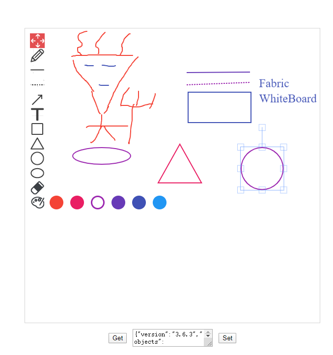

# fabric-whiteboard

This is a whiteboard react component base on fabricjs.

<br/>

### ScreenShots



<br/>

### Features

- Freely drag the palette.
- Arrow,Square,Ellipse,Line,DotLine,Select,Erase,RayPen modes support.
- Text input mode support
- Get|Set all objects in json
- Pick color of brush
- Change thickness of brushsss
- Event of single object like new、move、scale、delete、modify
- Operations of single object like new、move、scale、delete、modify

<br/>

### Todo

- Animations

<br/>

### Instal

```sh
$ npm install fabric-whiteboard

# or

$ yarn add fabric-whiteboard
```

<br/>

### Usage

```scss
.App {
  text-align: center;
  width: 100vw;
  height: 100vh;

  display: flex;
  flex-direction: column;
  justify-content: center;
  align-items: center;
}

.toolbar {
  margin: 12px 0px;

  display: flex;
  flex-direction: row;
  align-items: center;
}

.toolbar-button {
  margin: 0px 12px;
}
```

```js
export default {
  pen:
    '{"mode":"pen","obj":{"type":"path","version":"3.6.3","originX":"left","originY":"top","left":183,"top":548,"width":176,"height":24,"fill":null,"stroke":"#f44336","strokeWidth":2,"strokeDashArray":null,"strokeLineCap":"round","strokeDashOffset":0,"strokeLineJoin":"round","strokeMiterLimit":10,"scaleX":1,"scaleY":1,"angle":0,"flipX":false,"flipY":false,"opacity":1,"shadow":null,"visible":true,"clipTo":null,"backgroundColor":"","fillRule":"nonzero","paintFirst":"fill","globalCompositeOperation":"source-over","transformMatrix":null,"skewX":0,"skewY":0,"path":[["M",184,548.998],["Q",184,549,184,549.5],["Q",184,550,184,551],["Q",184,552,184,553],["Q",184,554,184,554.5],["Q",184,555,184,556],["Q",184,557,184.5,557.5],["Q",185,558,185,558.5],["Q",185,559,185.5,559],["Q",186,559,186,559.5],["Q",186,560,186,560.5],["Q",186,561,186.5,561],["Q",187,561,187.5,561.5],["Q",188,562,188.5,562],["Q",189,562,189.5,562],["Q",190,562,191.5,562],["Q",193,562,194.5,562.5],["Q",196,563,201,564],["Q",206,565,208.5,565],["Q",211,565,220,566],["Q",229,567,230.5,567],["Q",232,567,237,567],["Q",242,567,246.5,567],["Q",251,567,252.5,567],["Q",254,567,256.5,567],["Q",259,567,260.5,567],["Q",262,567,263.5,567],["Q",265,567,269,567],["Q",273,567,273.5,567],["Q",274,567,277,566],["Q",280,565,281,564.5],["Q",282,564,282.5,563.5],["Q",283,563,283.5,562.5],["Q",284,562,284,561],["Q",284,560,284.5,560],["Q",285,560,285,559.5],["Q",285,559,285,558.5],["Q",285,558,285,557.5],["Q",285,557,285,556.5],["Q",285,556,285,555.5],["Q",285,555,285,553.5],["Q",285,552,284.5,551.5],["Q",284,551,283.5,551],["Q",283,551,282.5,551],["Q",282,551,282,550.5],["Q",282,550,281.5,550],["Q",281,550,280.5,550],["Q",280,550,279.5,550],["Q",279,550,278.5,550],["Q",278,550,277.5,550],["Q",277,550,276.5,550.5],["Q",276,551,275.5,552.5],["Q",275,554,275,554.5],["Q",275,555,274.5,555.5],["Q",274,556,274,557],["Q",274,558,274,559],["Q",274,560,274,560.5],["Q",274,561,274,561.5],["Q",274,562,274,562.5],["Q",274,563,274,564],["Q",274,565,274.5,565.5],["Q",275,566,276,567],["Q",277,568,278,568.5],["Q",279,569,279.5,569.5],["Q",280,570,281,570],["Q",282,570,283,570.5],["Q",284,571,285,571],["Q",286,571,287,571.5],["Q",288,572,288.5,572],["Q",289,572,291,572.5],["Q",293,573,294,573],["Q",295,573,300,573],["Q",305,573,307.5,573],["Q",310,573,313,573],["Q",316,573,325.5,571],["Q",335,569,341,568.5],["Q",347,568,351.5,567.5],["Q",356,567,357.5,567],["Q",359,567,359,566.5],["Q",359,566,359.5,566],["L",360.002,566]]}}',
  line:
    '{"mode":"line","obj":{"type":"line","version":"3.6.3","originX":"left","originY":"top","left":87,"top":62,"width":150,"height":0,"fill":"rgb(0,0,0)","stroke":"#f44336","strokeWidth":2,"strokeDashArray":null,"strokeLineCap":"butt","strokeDashOffset":0,"strokeLineJoin":"miter","strokeMiterLimit":4,"scaleX":1,"scaleY":1,"angle":0,"flipX":false,"flipY":false,"opacity":1,"shadow":null,"visible":true,"clipTo":null,"backgroundColor":"","fillRule":"nonzero","paintFirst":"fill","globalCompositeOperation":"source-over","transformMatrix":null,"skewX":0,"skewY":0,"x1":-75,"x2":75,"y1":0,"y2":0}}',
  dotLine:
    '{"mode":"dotline","obj":{"type":"line","version":"3.6.3","originX":"left","originY":"top","left":82,"top":107,"width":156,"height":0,"fill":"rgb(0,0,0)","stroke":"#9c27b0","strokeWidth":2,"strokeDashArray":[3,2],"strokeLineCap":"butt","strokeDashOffset":0,"strokeLineJoin":"miter","strokeMiterLimit":4,"scaleX":1,"scaleY":1,"angle":0,"flipX":false,"flipY":false,"opacity":1,"shadow":null,"visible":true,"clipTo":null,"backgroundColor":"","fillRule":"nonzero","paintFirst":"fill","globalCompositeOperation":"source-over","transformMatrix":null,"skewX":0,"skewY":0,"x1":-78,"x2":78,"y1":0,"y2":0}}',
  arrow:
    '{"mode":"arrow","obj":{"type":"path","version":"3.6.3","originX":"left","originY":"top","left":305,"top":38,"width":97,"height":93,"fill":"rgba(255,255,255,0)","stroke":"#2196f3","strokeWidth":2,"strokeDashArray":null,"strokeLineCap":"butt","strokeDashOffset":0,"strokeLineJoin":"miter","strokeMiterLimit":4,"scaleX":1,"scaleY":1,"angle":0,"flipX":false,"flipY":false,"opacity":1,"shadow":null,"visible":true,"clipTo":null,"backgroundColor":"","fillRule":"nonzero","paintFirst":"fill","globalCompositeOperation":"source-over","transformMatrix":null,"skewX":0,"skewY":0,"path":[["M",306,39],["L",403,132],["M",395.0511896518709,115.85018842062],["L",403,132],["L",386.52995922141145,124.73792338572292]]}}',
  text:
    '{"mode":"text","obj":{"type":"textbox","version":"3.6.3","originX":"left","originY":"top","left":211,"top":203,"width":150,"height":27.12,"fill":"#f44336","stroke":null,"strokeWidth":1,"strokeDashArray":null,"strokeLineCap":"butt","strokeDashOffset":0,"strokeLineJoin":"miter","strokeMiterLimit":4,"scaleX":1,"scaleY":1,"angle":0,"flipX":false,"flipY":false,"opacity":1,"shadow":null,"visible":true,"clipTo":null,"backgroundColor":"","fillRule":"nonzero","paintFirst":"fill","globalCompositeOperation":"source-over","transformMatrix":null,"skewX":0,"skewY":0,"text":"adsfadsf","fontSize":24,"fontWeight":"normal","fontFamily":"Times New Roman","fontStyle":"normal","lineHeight":1.16,"underline":false,"overline":false,"linethrough":false,"textAlign":"left","textBackgroundColor":"","charSpacing":0,"minWidth":20,"splitByGrapheme":false,"styles":{}}}',
  rectangle:
    '{"mode":"rectangle","obj":{"type":"path","version":"3.6.3","originX":"left","originY":"top","left":319,"top":206,"width":141,"height":109,"fill":"rgba(255, 255, 255, 0)","stroke":"#2196f3","strokeWidth":2,"strokeDashArray":null,"strokeLineCap":"butt","strokeDashOffset":0,"strokeLineJoin":"miter","strokeMiterLimit":4,"scaleX":1,"scaleY":1,"angle":0,"flipX":false,"flipY":false,"opacity":1,"shadow":null,"visible":true,"clipTo":null,"backgroundColor":"","fillRule":"nonzero","paintFirst":"fill","globalCompositeOperation":"source-over","transformMatrix":null,"skewX":0,"skewY":0,"path":[["M",319,206],["L",460,206],["L",460,315],["L",319,315],["L",319,206],["z"]]}}',
  triangle:
    '{"mode":"triangle","obj":{"type":"triangle","version":"3.6.3","originX":"left","originY":"top","left":120,"top":286,"width":83.85,"height":75,"fill":"rgba(255,255,255,0)","stroke":"#2196f3","strokeWidth":2,"strokeDashArray":null,"strokeLineCap":"butt","strokeDashOffset":0,"strokeLineJoin":"miter","strokeMiterLimit":4,"scaleX":1,"scaleY":1,"angle":0,"flipX":false,"flipY":false,"opacity":1,"shadow":null,"visible":true,"clipTo":null,"backgroundColor":"","fillRule":"nonzero","paintFirst":"fill","globalCompositeOperation":"source-over","transformMatrix":null,"skewX":0,"skewY":0}}',
  circle:
    '{"mode":"circle","obj":{"type":"circle","version":"3.6.3","originX":"left","originY":"top","left":172,"top":439,"width":89.81,"height":89.81,"fill":"rgba(255, 255, 255, 0)","stroke":"#2196f3","strokeWidth":2,"strokeDashArray":null,"strokeLineCap":"butt","strokeDashOffset":0,"strokeLineJoin":"miter","strokeMiterLimit":4,"scaleX":1,"scaleY":1,"angle":0,"flipX":false,"flipY":false,"opacity":1,"shadow":null,"visible":true,"clipTo":null,"backgroundColor":"","fillRule":"nonzero","paintFirst":"fill","globalCompositeOperation":"source-over","transformMatrix":null,"skewX":0,"skewY":0,"radius":44.90267252625394,"startAngle":0,"endAngle":6.283185307179586}}',
  ellipse:
    '{"mode":"ellipse","obj":{"type":"ellipse","version":"3.6.3","originX":"center","originY":"center","left":328,"top":392,"width":142,"height":98,"fill":"rgba(255, 255, 255, 0)","stroke":"#2196f3","strokeWidth":2,"strokeDashArray":null,"strokeLineCap":"butt","strokeDashOffset":0,"strokeLineJoin":"miter","strokeMiterLimit":4,"scaleX":1,"scaleY":1,"angle":0,"flipX":false,"flipY":false,"opacity":1,"shadow":null,"visible":true,"clipTo":null,"backgroundColor":"","fillRule":"nonzero","paintFirst":"fill","globalCompositeOperation":"source-over","transformMatrix":null,"skewX":0,"skewY":0,"rx":71,"ry":49}}',
}
```

```js
import React, { Component } from 'react'

import objects from './objects'
import './App.css'

import WhiteBoard, {
  getWhiteBoardData,
  loadWhiteBoardData,
  addWhiteBoardObject,
  modifyWhiteBoardObjects,
  removeWhiteBoardObjects,
  clearWhiteBoardContext,
  createWhiteBoardSelection,
  updateWhiteBoardSelection,
  clearWhiteBoardSelection,
} from 'fabric-whiteboard'

export default class App extends Component {
  constructor(props) {
    super(props)
    this.state = {
      mode: 'select',
      width: '600px',
      height: '600px',
      brushColor: '#f44336',
      brushThickness: 2,
    }

    this.refLeft = undefined
    this.refRight = undefined

    this.calcBoundsSize = this.calcBoundsSize.bind(this)
    this.handleBoundsSizeChange = this.handleBoundsSizeChange.bind(this)

    this.handleOnModeClick = this.handleOnModeClick.bind(this)
    this.handleOnBrushColorChange = this.handleOnBrushColorChange.bind(this)
    this.handleOnBrushThicknessChange = this.handleOnBrushThicknessChange.bind(
      this
    )
    this.handleOnObjectAdded = this.handleOnObjectAdded.bind(this)
    this.handleOnObjectsModified = this.handleOnObjectsModified.bind(this)
    this.handleOnObjectsRemoved = this.handleOnObjectsRemoved.bind(this)
    this.handleOnSelectionCreated = this.handleOnSelectionCreated.bind(this)
    this.handleOnSelectionUpdated = this.handleOnSelectionUpdated.bind(this)
    this.handleOnSelectionCleared = this.handleOnSelectionCleared.bind(this)
  }

  componentDidMount() {
    this.calcBoundsSize()

    window.addEventListener('resize', this.handleBoundsSizeChange)
  }

  componentWillUnmount() {
    window.removeEventListener('resize', this.handleBoundsSizeChange)
  }

  render() {
    const { mode, width, height, brushColor, brushThickness } = this.state

    return (
      <div className="App" id="App">
        <div className="whiteboard" id="whiteboard">
          <WhiteBoard
            ref={(ref) => {
              this.refLeft = ref
            }}
            width={width}
            height={height}
            showToolbar={true}
            enableToolbar={true}
            showBoard={true}
            mode={mode}
            onModeClick={this.handleOnModeClick}
            brushColor={brushColor}
            brushColors={[
              '#f44336',
              '#e91e63',
              '#9c27b0',
              '#673ab7',
              '#3f51b5',
              '#2196f3',
            ]}
            brushThickness={brushThickness}
            onBrushColorChange={this.handleOnBrushColorChange}
            onBrushThicknessChange={this.handleOnBrushThicknessChange}
            onObjectAdded={this.handleOnObjectAdded}
            onObjectsModified={this.handleOnObjectsModified}
            onObjectsRemoved={this.handleOnObjectsRemoved}
            onSelectionCreated={this.handleOnSelectionCreated}
            onSelectionUpdated={this.handleOnSelectionUpdated}
            onSelectionCleared={this.handleOnSelectionCleared}
          />

          <WhiteBoard
            ref={(ref) => {
              this.refRight = ref
            }}
            width={width}
            height={height}
            showToolbar={true}
            enableToolbar={false}
            showBoard={true}
            mode={mode}
            brushColor={brushColor}
            brushColors={[
              '#f44336',
              '#e91e63',
              '#9c27b0',
              '#673ab7',
              '#3f51b5',
              '#2196f3',
            ]}
            brushThickness={brushThickness}
          />
        </div>

        <div className="toolbar" id="toolbar">
          <button
            className="toolbar-button"
            onClick={() => {
              const jsonData = getWhiteBoardData(this.refLeft)
              console.info(JSON.stringify(jsonData))
              const domTextarea = document.getElementById('toolbar-textarea')
              if (domTextarea) {
                domTextarea.value = JSON.stringify(jsonData)
              }
            }}
          >
            Get
          </button>

          <textarea id="toolbar-textarea"></textarea>
          <button
            className="toolbar-button"
            onClick={() => {
              const domTextarea = document.getElementById('toolbar-textarea')
              if (
                domTextarea &&
                domTextarea.value &&
                domTextarea.value !== ''
              ) {
                loadWhiteBoardData(this.refRight, domTextarea.value, (e) => {
                  console.info('load whiteboard data succed', e)
                })
                loadWhiteBoardData(this.refLeft, domTextarea.value, (e) => {
                  console.info('load whiteboard data succed', e)
                })
              }
            }}
          >
            Set
          </button>
          <button
            className="toolbar-button"
            onClick={() => {
              clearWhiteBoardContext(this.refLeft)
              clearWhiteBoardContext(this.refRight)
            }}
          >
            Clear
          </button>
        </div>

        <div className="toolbar">
          <button
            className="toolbar-button"
            onClick={() => {
              addWhiteBoardObject(this.refRight, objects.pen)
            }}
          >
            Add Pen
          </button>

          <button
            className="toolbar-button"
            onClick={() => {
              addWhiteBoardObject(this.refRight, objects.line)
            }}
          >
            Add Line
          </button>

          <button
            className="toolbar-button"
            onClick={() => {
              addWhiteBoardObject(this.refRight, objects.dotLine)
            }}
          >
            Add DotLine
          </button>

          <button
            className="toolbar-button"
            onClick={() => {
              addWhiteBoardObject(this.refRight, objects.arrow)
            }}
          >
            Add Arrow
          </button>

          <button
            className="toolbar-button"
            onClick={() => {
              addWhiteBoardObject(this.refRight, objects.text)
            }}
          >
            Add Text
          </button>

          <button
            className="toolbar-button"
            onClick={() => {
              addWhiteBoardObject(this.refRight, objects.rectangle)
            }}
          >
            Add Rectangle
          </button>

          <button
            className="toolbar-button"
            onClick={() => {
              addWhiteBoardObject(this.refRight, objects.triangle)
            }}
          >
            Add Triangle
          </button>

          <button
            className="toolbar-button"
            onClick={() => {
              addWhiteBoardObject(this.refRight, objects.circle)
            }}
          >
            Add Circle
          </button>

          <button
            className="toolbar-button"
            onClick={() => {
              addWhiteBoardObject(this.refRight, objects.ellipse)
            }}
          >
            Add Ellipse
          </button>
        </div>
      </div>
    )
  }

  calcBoundsSize() {
    return
    const domApp = document.getElementById('App')
    const domToolbar = document.getElementById('toolbar')

    const domAppStyle = window.getComputedStyle(domApp)
    const domToolbarStyle = window.getComputedStyle(domToolbar)

    this.setState({
      width: domAppStyle.width,
      height: `${
        parseInt(domAppStyle.height, 10) -
        parseInt(domToolbarStyle.height, 10) -
        20
      }px`,
    })
  }

  handleBoundsSizeChange() {
    this.calcBoundsSize()
  }

  handleOnModeClick(mode) {
    this.setState({
      mode: mode,
    })
  }

  handleOnBrushColorChange(color) {
    this.setState({
      brushColor: color.hex,
    })
  }

  handleOnBrushThicknessChange(thickness) {
    this.setState({
      brushThickness: thickness,
    })
  }

  handleOnObjectAdded(object) {
    addWhiteBoardObject(this.refRight, object)
  }

  handleOnObjectsModified(object) {
    modifyWhiteBoardObjects(this.refRight, object)
  }

  handleOnObjectsRemoved(objects) {
    removeWhiteBoardObjects(this.refRight, objects)
  }

  handleOnSelectionCreated(selection) {
    createWhiteBoardSelection(this.refRight, selection)
  }

  handleOnSelectionUpdated(selection) {
    updateWhiteBoardSelection(this.refRight, selection)
  }

  handleOnSelectionCleared(selection) {
    clearWhiteBoardSelection(this.refRight, selection)
  }
}
```
